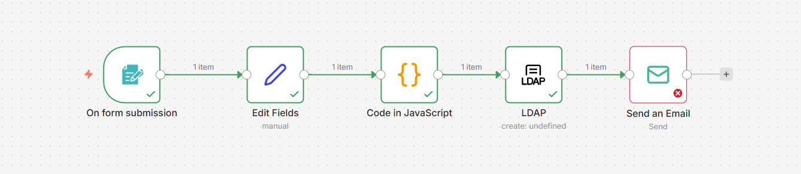

# 🚀 n8n LDAP User Provisioning (EN)

This project automates user creation and management in **LDAP / Active Directory** using **n8n**. It turns a standard form submission into a secure, standardized system administration task.

## 💡 Key Features
* **Smart Triggering**: Data capture via Webhooks/Forms.
* **JS Normalization**: Custom JavaScript for advanced data formatting.
* **LDAP Integration**: Automated entry creation in the target directory.
* **Error Handling**: Real-time email notifications for success or failure.

## 🛠️ Tech Stack
* **n8n** (Automation Engine)
* **JavaScript** (Data Transformation)
* **LDAP / AD** (Target Directory)

## 📦 Setup
1. Import the workflow JSON file into n8n.
2. Configure your **LDAP Credentials** in the n8n settings.
3. Adjust the "Edit Fields" node variables to match your schema.

---
*Project created to demonstrate IT automation and workflow orchestration skills.*
